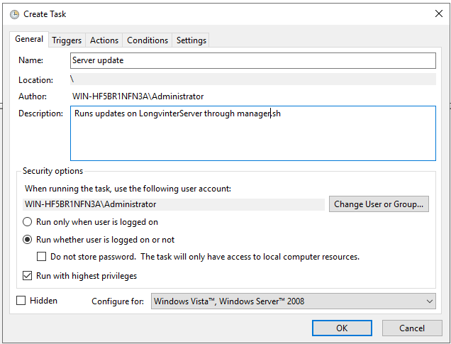
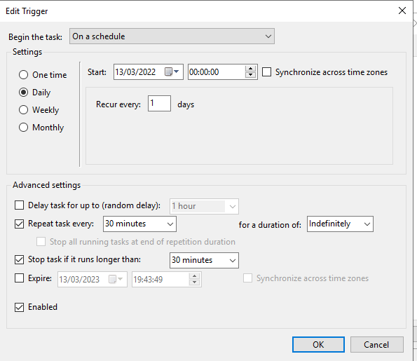
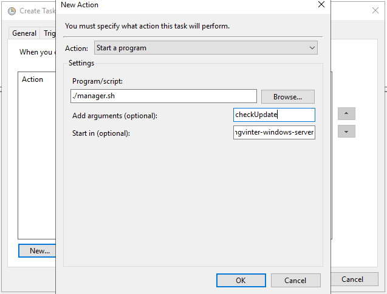

# longvinter-bashmanager
To control GIT lifecycle of the server + some more QoL services

Commands available:

- `./manager.sh` 
*Check server for an update, then launch the game server and finally display the direct key in CLI*
  
- `./manager.sh getKey` 
*Get the direct key and display it in CLI*
  
- `./manager.sh checkUpdate` 
*To set up with a cron/Task Scheduler, it checks for updates on main branch, then
stop the server to update it, and finally starts server back*
  
- `./manager.sh kill` 
*Stops server*
  
- `./manager.sh status` 
*Check if server is running*

---
Setting up with Task Scheduler on windows
-

Open task scheduler, then create a new task.
Follow pictures settings as followed : 
 
 

---
This script is provided as-is, minimum support will be provided.
